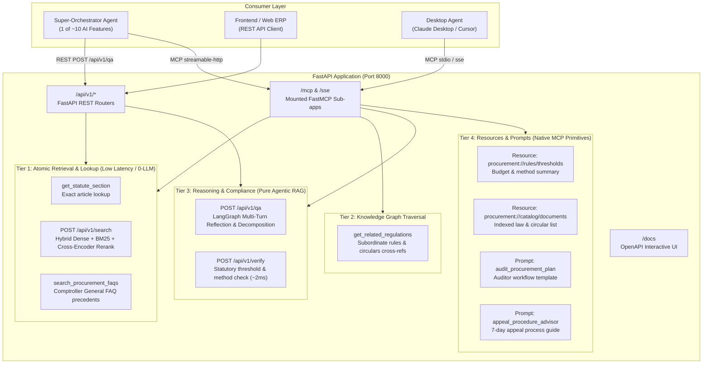

# Dual-Protocol Architecture: REST API & FastMCP Serving Layer

> **Production Serving Architecture for Thai Government Procurement Law LegalGraphRAG**  
> Exposes Pure LangGraph Agentic RAG over both **REST API** (FastAPI) and **Model Context Protocol** (FastMCP) on a unified port.

---

## 1. Architectural Overview & Dual-Protocol Design

The backend service is structured into a clean **4-Tier Interface** designed to plug seamlessly into:
1. **Super-Orchestrator Agents** (LangGraph, AutoGen, CrewAI) consuming sub-agents via REST or MCP
2. **AI Copilot & Frontend Clients** (via REST OpenAPI endpoints)
3. **Desktop AI Assistants** (Claude Desktop, Cursor via MCP protocol)



---

## 2. Super-Orchestrator Contract: `POST /api/v1/qa`

The primary integration endpoint for the Super-Orchestrator returns structured sub-issue decomposition:

### Request Schema (`LegalQARequest`)
```json
{
  "question": "หน่วยงานของรัฐสามารถจัดซื้อจัดจ้างโดยวิธีเฉพาะเจาะจงในวงเงินไม่เกินเท่าใด และต้องขออนุมัติใครบ้าง",
  "mode": "fast",
  "org_id": "DGA"
}
```

### Response Schema (`LegalQAResponse`)
```json
{
  "status": "COMPLIANT",
  "mode": "fast",
  "direct_answer": "หน่วยงานของรัฐสามารถจัดซื้อจัดจ้างพัสดุโดยวิธีเฉพาะเจาะจงได้ในวงเงินไม่เกิน 500,000 บาท และต้องขอความเห็นชอบรายงานขอซื้อขอจ้างจากหัวหน้าหน่วยงานของรัฐก่อนเริ่มกระบวนการจัดซื้อจัดจ้าง",
  "applicable_laws": [
    "พระราชบัญญัติการจัดซื้อจัดจ้างและการบริหารพัสดุภาครัฐ พ.ศ. 2560 มาตรา 56 (2) (ข)",
    "ระเบียบกระทรวงการคลังว่าด้วยการจัดซื้อจัดจ้างและการบริหารพัสดุภาครัฐ พ.ศ. 2560 ข้อ 25"
  ],
  "decisive_quotes": [
    {
      "filename": "พระราชบัญญัติการจัดซื้อจัดจ้างและการบริหารพัสดุภาครัฐ พ.ศ. 2560.md",
      "page": "มาตรา 56 (2) (ข)",
      "law": "พ.ร.บ. จัดซื้อจัดจ้างฯ มาตรา 56 (2) (ข)",
      "quote": "การจัดซื้อจัดจ้างพัสดุที่มีการผลิต จำหน่าย... หรือวงเงินไม่เกินที่กำหนดในกฎกระทรวง"
    }
  ],
  "issues_breakdown": [
    {
      "issue_id": "Q1",
      "topic": "วงเงินวิธีเฉพาะเจาะจง",
      "status": "RESOLVED",
      "answer": "วงเงินไม่เกิน 500,000 บาท ตามที่กำหนดในกฎกระทรวง",
      "missing_aspect": null
    },
    {
      "issue_id": "Q2",
      "topic": "ผู้อนุมัติรายงานขอซื้อขอจ้าง",
      "status": "RESOLVED",
      "answer": "ต้องได้รับความเห็นชอบจากหัวหน้าหน่วยงานของรัฐก่อนดำเนินการ",
      "missing_aspect": null
    }
  ],
  "exceptions_or_conditions": "ห้ามมิให้แบ่งซื้อหรือแบ่งจ้างพัสดุเพื่อลดวงเงินให้เข้าเกณฑ์วิธีเฉพาะเจาะจง",
  "organization_id": "DGA"
}
```

### สถานะใน `issues_breakdown` (Issue Statuses):
- **`RESOLVED`**: ระบบมีฐานกฎหมายครบถ้วนและตอบคำถามได้สมบูรณ์
- **`OUT_OF_LEGAL_SCOPE`**: ประเด็นอยู่นอกเหนือขอบเขตข้อกฎหมายการจัดซื้อจัดจ้าง (เช่น ถามเรื่องราคากลางทางวิศวกรรม, การคำนวณภาษี) โดยจะระบุใน `missing_aspect` เพื่อให้ Super-Orchestrator ส่งต่อไปยัง Feature Agent ตัวอื่น
- **`NO_LAW_FOUND`**: ไม่พบบทบัญญัติทางกฎหมายที่รองรับข้อเท็จจริงดังกล่าว

---

## 3. Quick Start & Execution

### 1) Run Production Server (Uvicorn + FastAPI + FastMCP)
```bash
python server.py --host 0.0.0.0 --port 8000
```
- **Swagger Documentation:** [http://localhost:8000/docs](http://localhost:8000/docs)
- **FastMCP Endpoint:** `http://localhost:8000/mcp`
- **Readiness Probe:** `http://localhost:8000/ready`

### 2) Run in MCP Stdio Mode (For Claude Desktop / Cursor)
```bash
python server.py --transport stdio
```

### 3) Configuration for Claude Desktop (`claude_desktop_config.json`)
```json
{
  "mcpServers": {
    "procurement-legal-agent": {
      "command": "python",
      "args": [
        "c:/Users/ACER/Downloads/ProcurementQA_Agent/server.py",
        "--transport",
        "stdio"
      ]
    }
  }
}
```
