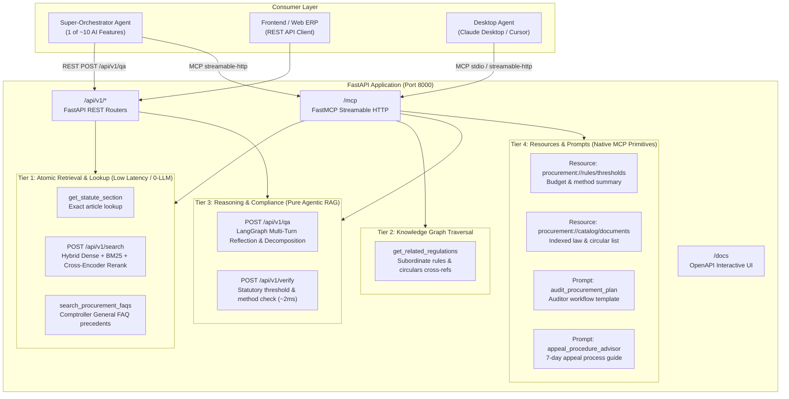

# Dual-Protocol Architecture: REST API & FastMCP Serving Layer

> **Production Serving Architecture for Thai Government Procurement Law LegalGraphRAG**  
> Exposes Pure LangGraph Agentic RAG over both **REST API** (FastAPI) and **Model Context Protocol** (FastMCP) on a unified port.

---

## 1. Architectural Overview & Dual-Protocol Design

The backend service is structured into a clean **4-Tier Interface** designed to plug seamlessly into:
1. **Super-Orchestrator Agents** (LangGraph, AutoGen, CrewAI) consuming sub-agents via REST or MCP
2. **AI Copilot & Frontend Clients** (via REST OpenAPI endpoints)
3. **Desktop AI Assistants** (Claude Desktop, Cursor via MCP protocol)



---

## 2. Super-Orchestrator Contract: `POST /api/v1/qa`

### Request
```json
{
  "query": "หน่วยงานของรัฐจัดซื้อโดยวิธีเฉพาะเจาะจงได้ในวงเงินไม่เกินเท่าใด และต้องขออนุมัติใครบ้าง",
  "org_id": "DGA"
}
```
`org_id` is optional: falls back to the `X-Organization-Id` header, then `DEFAULT_ORG_ID`.
The same contract is returned by the MCP tool `ask_procurement_law(query, org_id)`.

### Response
```json
{
  "status": "COMPLIANT",
  "answer": "หน่วยงานของรัฐสามารถสั่งซื้อหรือสั่งจ้างโดยวิธีเฉพาะเจาะจงได้ภายในวงเงินที่กำหนดตามตำแหน่งผู้สั่งซื้อ ...",
  "conditions": "กรณีที่มีความจำเป็นเร่งด่วน ... ให้ดำเนินการไปก่อนแล้วรีบรายงานขอความเห็นชอบต่อหัวหน้าหน่วยงานของรัฐ",
  "citations": [
    {
      "law": "พระราชบัญญัติการจัดซื้อจัดจ้างและการบริหารพัสดุภาครัฐ พ.ศ. 2560 มาตรา 56",
      "quote": "การจัดซื้อจัดจ้างพัสดุ ... โดยวิธีเฉพาะเจาะจง ...",
      "filename": "พรบ/พระราชบัญญัติการจัดซื้อจัดจ้างและการบริหารพัสดุภาครัฐ พ.ศ. 2560.md",
      "page": "19-20/42"
    },
    {
      "law": "ระเบียบกระทรวงการคลังว่าด้วยการจัดซื้อจัดจ้างและการบริหารพัสดุภาครัฐ พ.ศ. 2560 ข้อ 86",
      "quote": "การสั่งซื้อหรือสั่งจ้างโดยวิธีเฉพาะเจาะจงครั้งหนึ่ง ให้เป็นอำนาจของผู้ดำรงตำแหน่งและภายในวงเงิน ...",
      "filename": "ระเบียบกระทรวงการคลัง/ระเบียบกระทรวงการคลังว่าด้วยการจัดซื้อจัดจ้างและการบริหารพัสดุภาครัฐ พ.ศ. 2560.md",
      "page": "28/72"
    }
  ],
  "unresolved_issues": [],
  "grounded": true,
  "org_id": "DGA"
}
```

| Field | Meaning |
|---|---|
| `status` | `COMPLIANT`, `PARTIALLY_RESOLVED`, `NO_LAW_FOUND` or `OUT_OF_LEGAL_SCOPE` |
| `answer` | Direct legal answer covering every resolved sub-question |
| `conditions` | Exceptions, thresholds or prerequisites qualifying the answer; `null` if none |
| `citations[]` | Laws relied on. `quote` is verbatim statutory text. `filename` is the OCR document path under `datas/typhoon_ocr/` and `page` its page range (`start-end/total`); both are `null` when the cited law is not in the corpus (e.g. a repealed regulation) or its page could not be recovered |
| `unresolved_issues[]` | Only sub-questions that were **not** answered (`NO_LAW_FOUND` / `OUT_OF_LEGAL_SCOPE`), with `missing_aspect`, so the orchestrator can delegate them to another agent |
| `grounded` | `true` when every cited section appears in the retrieved evidence (guardrail); `false` means treat the answer with caution; `null` if not evaluated |
| `org_id` | Tenant the answer was scoped to |

---

## 3. Quick Start & Execution

### 1) Run Production Server (Uvicorn + FastAPI + FastMCP)
```bash
python server.py --host 0.0.0.0 --port 8000
```
- **Swagger Documentation:** [http://localhost:8000/docs](http://localhost:8000/docs)
- **FastMCP Endpoint:** `http://localhost:8000/mcp`
- **Readiness Probe:** `http://localhost:8000/ready`

### 2) Run in MCP Stdio Mode (For Claude Desktop / Cursor)
```bash
python server.py --transport stdio
```

### 3) Configuration for Claude Desktop (`claude_desktop_config.json`)
```json
{
  "mcpServers": {
    "procurement-legal-agent": {
      "command": "python",
      "args": [
        "c:/Users/ACER/Downloads/ProcurementQA_Agent/server.py",
        "--transport",
        "stdio"
      ]
    }
  }
}
```
