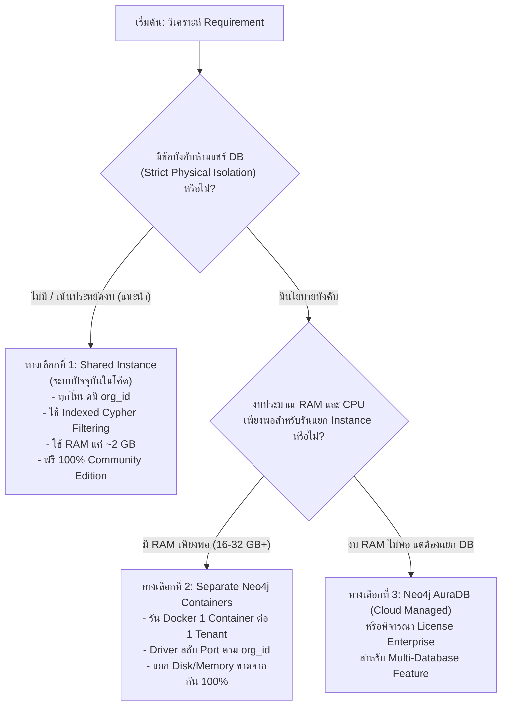

# Multi-Tenancy Architecture & Stakeholder Requirement Checklist

> **เอกสารคู่มือคำถามและแนวทางการเก็บ Requirement เรื่อง Multi-Tenancy**  
> สำหรับนำไปประชุมและสรุปทิศทางกับทีม Infrastructure, Security, และ Product Owner

---

## 📌 1. บริบทปัจจุบันของระบบ (Current Multi-Tenancy Baseline)

ระบบ **ProcurementQA_Agent (ProcurementQAPipeline)** รองรับการแบ่งแยกข้อมูล (Tenant Isolation) ในทั้ง 3 ฐานข้อมูล (Tri-Store) ดังนี้:

| ฐานข้อมูล | บทบาทในระบบ | รูปแบบ Isolation ปัจจุบัน | สถานะ |
| :--- | :--- | :--- | :--- |
| **PostgreSQL** | RDBMS / Canonical Data | **Row-Level Security (RLS)** แบ่งแยกตาม `org_id` ผ่าน Session Variable | พร้อมใช้งาน ✅ |
| **Qdrant** | Dense Vector Embeddings | **Payload Metadata Filtering** สโคปการค้นหา `Filter(key="org_id", match=...)` | พร้อมใช้งาน ✅ |
| **Neo4j** | Knowledge Graph / Topology | **Property-Level Isolation + B-Tree Indexes** ผ่าน `coalesce(n.org_id, 'PUBLIC')` | พร้อมใช้งาน ✅ (Community Edition) |

---

## ❓ 2. คำถามสำคัญที่ต้องถามทีม Stakeholder / Infrastructure

โปรดนำคำถาม 5 ข้อนี้ไปหารือกับทีม Infrastructure / IT Security เพื่อตัดสินใจเลือกสถาปัตยกรรมที่ถูกต้อง:

### 1) ข้อกำหนดด้าน Data Governance & Security Compliance
- **คำถาม:** "หน่วยงานหรือลูกค้าของเรา มีระเบียบข้อบังคับ (Compliance / Audit) ที่**ห้ามเก็บข้อมูลใน Database Instance เดียวกันโดยเด็ดขาด** หรือไม่?"
- **ทางเลือกคำตอบ:**
  - **แบบที่ A (อนุญาต Logical Isolation):** สามารถเก็บใน DB เดียวกันได้ โดยใช้ `org_id` / RLS ในการกั้นสิทธิ์ (ประหยัดงบและ RAM มหาศาล)
  - **แบบที่ B (ต้องใช้ Physical/Process Isolation):** กฎหมายหรือนโยบายบังคับว่าแต่ละ Tenant ต้องมี Database / Container แยกต่างหาก ห้ามปนกันในระดับ Disk/RAM

---

### 2) งบประมาณและสเปกเครื่องเซิร์ฟเวอร์ (Hardware Resources)
- **คำถาม:** "เซิร์ฟเวอร์ที่จะใช้ Deploy บน Production มีขนาด RAM และ CPU เท่าใด และคาดว่าจะมีจำนวน Tenant ทั้งหมดกี่องค์กร?"
- **การประเมินผล:**
  - Neo4j Community รันบน Java Virtual Machine (JVM) กิน RAM ขั้นต่ำประมาณ **1.5 – 2 GB ต่อ 1 Instance**
  - **หากมี 10 Tenants:**
    - ถ้าแยก Instance: จะต้องใช้ RAM สำหรับ Neo4j ขั้นต่ำ **15 – 20 GB**
    - ถ้าใช้ Shared Instance (วิธีปัจจุบัน): ใช้ RAM รวมเพียง **2 – 3 GB** เท่านั้น

---

### 3) ธรรมชาติของข้อมูล (Public Law vs. Internal Policies)
- **คำถาม:** "ข้อมูลที่แต่ละ Tenant ต้องการสืบค้น เป็นกฎหมายกลางของประเทศ หรือเป็นเอกสารลับเฉพาะองค์กรเป็นหลัก?"
- **แนวทาง Legal RAG:**
  - โดยธรรมชาติ กฎหมายหลัก 700+ มาตรา (พ.ร.บ. จัดซื้อจัดจ้างฯ, ระเบียบกระทรวงการคลัง) เป็น **ข้อมูลสาธารณะ (PUBLIC)** ที่ทุกองค์กรใช้ร่วมกัน
  - เอกสารเฉพาะของแต่ละ Tenant มักเป็นเพียงข้อบังคับภายใน หรือประกาศเฉพาะหน่วยงาน (Private Knowledge)
  - การแชร์ตัวบทกฎหมายหลักร่วมกันใน Neo4j จะช่วยลดการ Duplicate ข้อมูลซ้ำซ้อน 10–20 เท่า

---

### 4) ความถี่และขั้นตอนการเพิ่ม Tenant ใหม่ (Tenant Onboarding)
- **คำถาม:** "ในอนาคต เราจะมี Tenant ใหม่เพิ่มขึ้นบ่อยแค่ไหน (เช่น สัปดาห์ละ 1 หน่วยงาน หรือนานๆ ครั้ง) และต้องการให้ระบบสร้าง Tenant อัตโนมัติ (Dynamic Provisioning) หรือไม่?"
- **ผลกระทบ:**
  - ถ้าเป็น Shared Instance: เพิ่ม Tenant ใหม่ได้ทันทีเพียงกำหนด `org_id` ใหม่ โดยไม่ต้อง Restart ระบบหรือสร้าง Container เพิ่ม
  - ถ้าเป็น Separate Container: ต้องมี Docker/Kubernetes Automation ในการ Spin-up Pod ใหม่ และตั้งค่า Network Routing

---

### 5) นโยบายการสำรองข้อมูล (Backup & Restore Per Tenant)
- **คำถาม:** "ลูกค้าหรือ Tenant แต่ละรายต้องการ Backup/Export ข้อมูลกราฟของตนเองแยกเดี่ยวๆ โดยไม่ปนกับผู้อื่นหรือไม่?"
- **ผลกระทบ:**
  - ถ้าใช้ Separate Instance: สามารถ Dump database file (`neo4j-admin dump`) ของแต่ละ Tenant ออกมาเดี่ยวๆ ได้ง่าย
  - ถ้าใช้ Shared Instance: ต้องรัน Cypher Export สคริปต์กรองเฉพาะ `org_id` ของ Tenant นั้นๆ

---

## 🛠️ 3. แผนที่การตัดสินใจทางสถาปัตยกรรม (Decision Matrix)

---

## 📋 4. ข้อสรุปที่ทีมสามารถเตรียมส่งกลับมา:

เมื่อคุณได้คำตอบจากทีม สามารถแจ้งข้อมูลสรุป 3 ข้อนี้:
1. **Security Level:** (A) Shared ได้ หรือ (B) ต้องแยก Container
2. **Server Specs:** ขนาด RAM (เช่น 8GB, 16GB, 32GB)
3. **Tenant Count:** จำนวนองค์กรเป้าหมายในระยะแรก (เช่น 3 องค์กร, 10 องค์กร)

*หากเลือกแนวทางที่ 2 (แยก Container) ระบบของเราสามารถปรับ Driver Connection Routing ให้รองรับได้ทันทีครับ*
