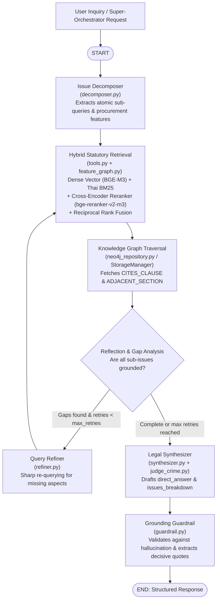

# Technical Architecture Report: Pure Agentic LegalGraphRAG

## 1. Overview & Evolution

**ProcurementQA_Agent (LegalGraphRAG)** is a state-of-the-art legal reasoning and statutory retrieval system tailored for Thai Public Procurement Law (พระราชบัญญัติการจัดซื้อจัดจ้างและการบริหารพัสดุภาครัฐ พ.ศ. 2560 and Ministry of Finance Regulations).

The system has evolved from a linear Corrective RAG (CRAG) pipeline into a **Pure Agentic RAG workflow powered by LangGraph**. It features iterative self-reflection, multi-issue query decomposition, reciprocal rank fusion hybrid search, knowledge graph traversal, and verbatim evidence extraction.

---

## 2. Core Architecture: Pure LangGraph Agentic Workflow

---

## 3. Key Components

### 1) Issue Decomposer (`core/agent/decomposer.py`)
Decomposes complex, multi-faceted inquiries into atomic sub-questions (`Q1`, `Q2`, etc.) to prevent dominant legal topics from overshadowing secondary topics during retrieval.

### 2) Hybrid Multi-Aspect Retrieval (`core/agent/tools.py`)
Combines:
- **Dense Semantic Embeddings:** Tokenmind BGE-M3 (1024-dim)
- **Sparse Lexical Search:** Tokenized Thai BM25 (PyThaiNLP newmm)
- **Neural Cross-Encoder Reranking:** BAAI `bge-reranker-v2-m3` running locally on CUDA/CPU
- **Reciprocal Rank Fusion (RRF):** Fuses scores across full inquiries and atomic sub-queries

### 3) Knowledge Graph Topology (`core/database/neo4j_repository.py`)
Models statutory relationships:
- `(:LegalDocument)-[:CONTAINS]->(:StatuteClause)`
- `(:StatuteClause)-[:CITES_CLAUSE]->(:StatuteClause)` (e.g. Acts citing Ministerial Regulations)
- `(:StatuteClause)-[:ADJACENT_SECTION]->(:StatuteClause)` (Sequential statutory context)
- `(:FAQCase)-[:RELATES_TO_LAW]->(:StatuteClause)` (Precedent consultation rulings)

### 4) Query Refiner & Reflection (`core/agent/refiner.py`)
Analyzes retrieval gaps. When sub-issues lack grounding and `retries < max_retries`, generates sharpened queries focusing strictly on the missing statutory elements.

### 5) Grounding Guardrail & Decisive Quotes (`core/agent/guardrail.py`)
Extracts verbatim statutory quotes from official gazette text supporting each legal conclusion, ensuring answers are strictly substantiated with zero hallucination.

---

## 4. Benchmark Performance & Evaluation

Evaluated against the held-out Thai Procurement QA Benchmark (40 complex multi-issue and single-issue cases):

| Metric | Target | Achieved Result | Evaluation Method |
| :--- | :--- | :--- | :--- |
| **Strict Hit Rate** | > 85.0% | **97.5% (39/40)** | Exact statutory section matching |
| **Section Recall@k (k=20)** | > 80.0% | **88.33%** | Multi-hop ground truth clause coverage |
| **Faithfulness / Grounding** | > 85.0% | **91.89% – 94.44%** | LLM-as-a-Judge against retrieved context |
| **Answer Relevancy** | > 90.0% | **95.95% – 98.61%** | LLM-as-a-Judge semantic alignment |
| **Hallucination Rate** | < 5.0% | **0.0%** | Zero fabricated section citations |

---

## 5. Serving & Production Integration

- **Dual-Protocol Serving:** FastAPI provides REST endpoints (`/api/v1/qa`, `/api/v1/search`, `/api/v1/verify`), while FastMCP provides native MCP endpoints (`/mcp`, `/sse`) on port 8000.
- **Super-Orchestrator Contract:** The `/api/v1/qa` endpoint returns `issues_breakdown`, cleanly marking each issue as `RESOLVED`, `OUT_OF_LEGAL_SCOPE`, or `NO_LAW_FOUND`, enabling seamless multi-agent orchestration.
